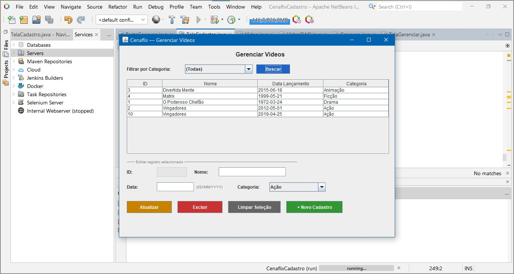
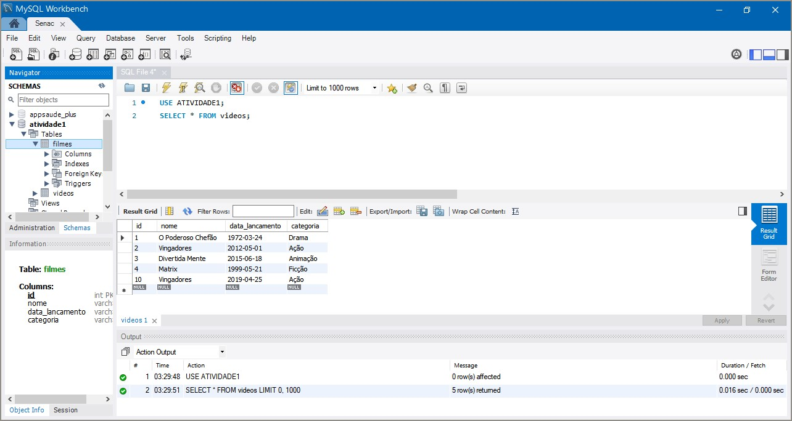

# Cenaflix - Gerenciador de Videos

Instituicao: SENAC
Curso: Tecnico em Desenvolvimento de Sistemas
Disciplina: Programacao para Desktop
Atividade: Sprint 1 e Sprint 2 - CRUD completo com JDBC

---

## Sobre o projeto

O Cenaflix e um sistema desktop de gerenciamento de videos com interface grafica.
Possui duas telas: TelaCadastro e TelaGerenciar.
Implementa CRUD completo com Java Swing e MySQL via JDBC.

---

## Funcionalidades

- Cadastro de videos com validacao de campos
- Alerta quando ID ja existe no banco
- Listagem em JTable com atualizacao dinamica
- Filtro por categoria (busca parcial com LIKE)
- Edicao de registros clicando na tabela
- Exclusao com confirmacao de seguranca
- Mensagens de erro descritivas em todos os catch
- Documentacao Javadoc em todas as classes

---

## Screenshots

### Tela de Gerenciamento com filtro


### Banco de dados MySQL


---

## Banco de dados

```sql
CREATE DATABASE ATIVIDADE1;
USE ATIVIDADE1;
CREATE TABLE videos (
  id              INT          PRIMARY KEY,
  nome            VARCHAR(100) NOT NULL,
  data_lancamento DATE         NOT NULL,
  categoria       VARCHAR(50)  NOT NULL
);
```sql

---

## Como executar

Pre-requisitos:
- Java JDK 17+
- MySQL 8+
- NetBeans 17+
- MySQL Connector/J 9.6+

Passo a passo:

1. Clone o repositorio
git clone https://github.com/simonerosicar/cenaflix-jdbc.git

2. Crie o banco no MySQL Workbench
CREATE DATABASE ATIVIDADE1;

3. Configure a senha em src/conexao/Conexao.java

4. Adicione o driver: Libraries - Add JAR - mysql-connector-j-9.6.0.jar

5. Execute: F6 no NetBeans

---

## Arquitetura

src/
- conexao/Conexao.java       - Conexao JDBC com MySQL
- model/Video.java           - Entidade de dados
- dao/VideoDAO.java          - CRUD completo
- TelaCadastro/
  - TelaCadastro.java        - Sprint 1 - Tela de cadastro
  - TelaGerenciar.java       - Sprint 2 - Tela de gerenciamento

Padrao: DAO (Data Access Object)

---

## Contexto academico

Instituicao : SENAC
Curso       : Tecnico em Desenvolvimento de Sistemas
Disciplina  : Programacao para Desktop
Atividade   : Sprint 1 e Sprint 2
Tecnologias : Java, Swing, JDBC, MySQL, Javadoc

---

## Autora

Simone Cardozo
Estudante - Tecnico em Desenvolvimento de Sistemas - SENAC
GitHub: https://github.com/simonerosicar
LinkedIn: https://linkedin.com/in/simone-cardozo-23a273362/
